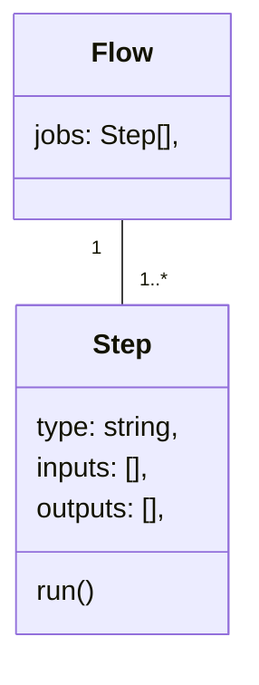

## Flow

```mermaid
classDiagram
    class Flow {
        jobs: Step[],
    }

    class Step {
        type: string,
        inputs: [],
        outputs: [],
        run()
    }

    Flow "1" -- "1..*" Step
```

`type`
- `soap-request`
- `rest-request`